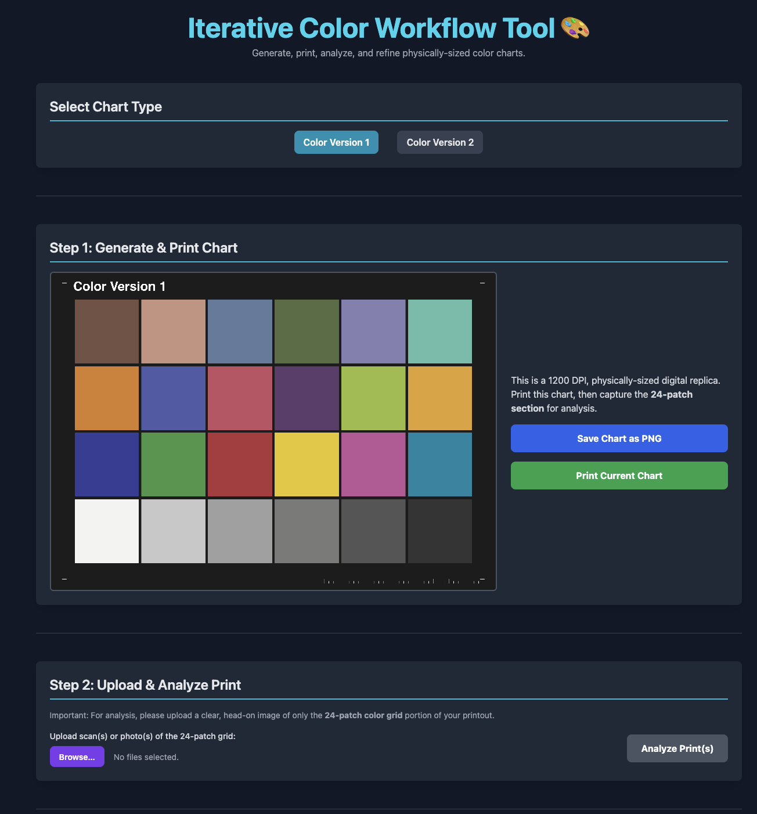
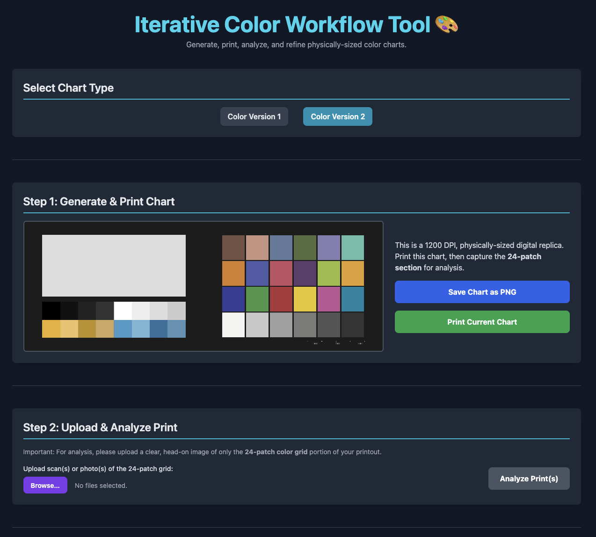

# Printable Color Calibration Chart Attempt

**Project Status: Failed** 🔴

I tried to create my own equivalent of ColorChecker that I could print for color adjustment. This is a little HTML file that generates the charts based on some decompiled code which was used to look for the charts and it works, but my laser printer did not produce satisfactory results.

I thought I'd share this to save someone else the time of creating a similar tool from scratch.

I'd seen DIY online of people grabbing paint swatches from hardware stores and I thought I could accomplish the equivalent. If you need one best to just buy it.

---

## The Goal

The idea was to build a self-contained web app to help calibrate a printer. The workflow is:
1.  Generate a digital ColorChecker chart (Classic or Passport version).
2.  Print it at its exact physical size.
3.  Scan the printout and upload it back into the app.
4.  The app analyzes the color differences and creates a new, "adjusted" chart to counteract the printer's color errors.

---

## Why It Failed

Ultimately, while the application functions as designed, the project is marked as 'failed' because the end-to-end workflow **did not produce a satisfactory color correction** for my specific laser printer. The goal of accurate, repeatable color was not achieved with my hardware.

---

## Features

* **Accurate Chart Replicas:** Dynamically generates the equivalent of the ColorChecker Classic and Passport layouts in a single HTML file.
* **Print-Ready:** Creates high-resolution (1200 DPI) images sized to their exact physical dimensions for printing at 100% scale.
* **Print Analysis:** Lets you upload a scan/photo of your print to measure the RGB color inaccuracies.
* **Iterative Correction:** Automatically generates a new, adjusted chart based on the analysis results.

---

---

## Technologies Used

* **React**
* **Tailwind CSS**
* **HTML**
